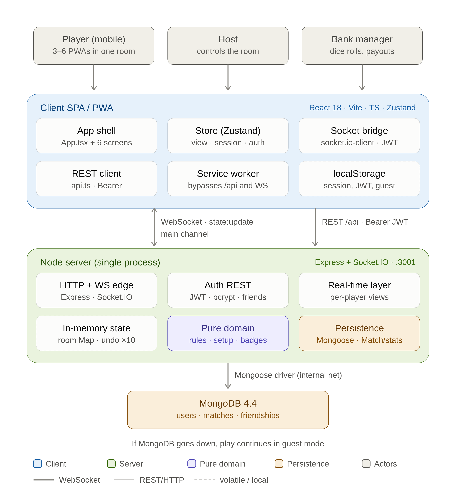
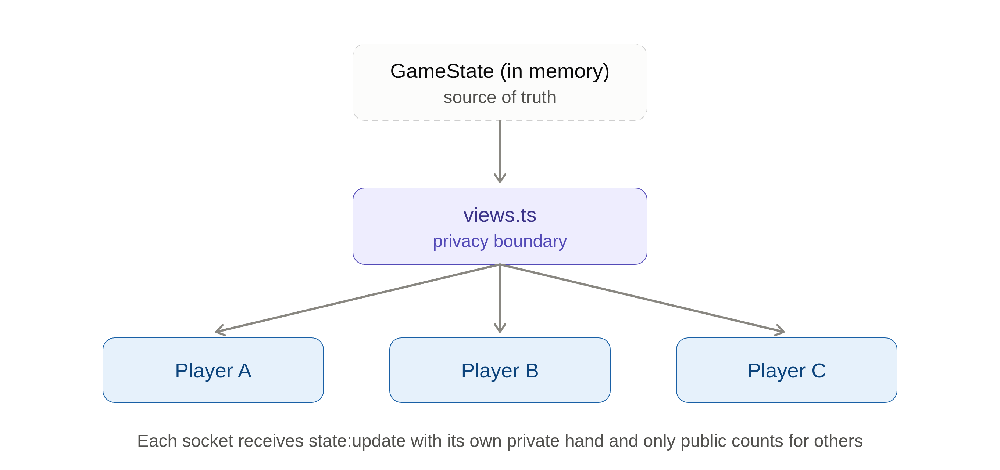

# Catán Assistant

**Mobile-first digital assistant** for in-person games of the Catan board game.
It replaces the paper score sheet and the resource cards; the physical board
still exists. Players' phones join the same room by code and stay in sync in real
time.

The interface is in Spanish; code identifiers are in English.

**▶ Live app: [catan-assistant.eviniegra.software](https://catan-assistant.eviniegra.software)** — installable as a PWA from Chrome/Edge/Android ("Install") and iOS ("Add to Home Screen").

---

## What it is

A **mobile-first web app (PWA)** that acts as a digital assistant for **in-person**
Catan games. The physical board stays on the table; the app takes over the
bookkeeping — the bank, resources, buildings and cards — so it's **cheat-proof and
shared in real time**.

- Several players join the **same session** from their phones with a **5-character
  room code** and see a shared state that updates instantly.
- Supports the **base game (3–4 players)**, the **5–6 player extension** (lobby
  toggle) and the **Cities & Knights expansion** (`citiesKnights` toggle, victory
  at 13 points).
- **100% Spanish UI**; **English code identifiers**.

## Features

**Accounts & identity**
- Register / log in with **JWT + bcrypt**; **guest mode** (play without earning
  stats). Session syncs across browser tabs (`storage` event).
- **Profile**: edit display name, preferred color and avatar; deterministic
  generated avatar (initials + color by hash) with a fallback if the image fails.
- **Stats**: games, wins/losses, win rate, total VP, badges (longest road /
  largest army), **current and longest win streak**, **XP + level**, and
  **achievements**.
- **Friends**: search users, send/accept/reject/cancel requests, remove friends,
  see who's **online**, **invite to the room** in real time, and view a friend's
  full profile.

**Room / lobby**
- Create a room (5-character code) and join by code; automatic **reconnection**
  via `sessionToken`.
- The host configures **colors** per player, **turn order** (manual or dice
  draw), the **bank manager**, the **5–6 extension** and **Cities & Knights**
  toggles, a **start without resources** toggle, and **extra rules**. The host can
  also **kick** players and **cancel** the room.
- Each player registers their **2 starting settlements** (the number+resource
  tokens they touch); starting the game is gated until everyone is ready (except
  in the "no tokens" mode).

**Gameplay engine**
- **Dice roll**: the bank manager enters the number (base) or the 3 dice
  (Cities & Knights); resources are distributed to settlements/cities and **dice
  statistics** are tracked.
- **The 7 sequence**: forced discard (> 7 cards) → move the robber → random steal.
  The robber can go to a board hex, the **desert**, or a **generic empty tile**.
  Extra robber rules are supported (no steal on the first round; empty tile/desert
  grants a bank resource).
- **Building**: roads, settlements, cities, development cards; an editable
  **construction table** that derives the production hexes; pending token
  registration after buying a settlement (with a **buy confirmation**).
- **Development cards**: Knight (+ Largest Army), Year of Plenty, Monopoly, Road
  Building, and Victory Point (private until used). Cards can't be played the turn
  they're bought. Each card has an illustrated **preview with a description**.
- **Trades**: with the bank/ports (4:1 / 3:1 / 2:1 ratios), **between players**
  (targeted or open offers, per-player rejection), and **use another player's
  port** with an optional commission (3-step flow).
- **Badges & victory**: Longest Road (assigned manually by bank/host), Largest
  Army (automatic), declare victory (10 base / 13 Cities & Knights) → the match
  and stats are persisted.
- **Bank**: manual card grants (cheat-proof: always announced publicly) and
  **undo** of the last action. The bank is **informational only** — it never
  blocks a grant.
- **Special Build Phase** (5–6 extension).
- **Leave a game** in progress (returns cards to the bank/decks and frees the
  seat) and **end a game** with no winner (host).
- Full **Cities & Knights expansion**: commodities, city improvements
  (trade/science/politics), metropolises, knights, city walls, the barbarian
  track, progress cards, aqueduct and merchant.

**Real time, privacy & feedback**
- Shared state over Socket.IO with a **personalized view**: other players' hands
  and card types are never sent — only public counts.
- **Your own hand is private too**: local toggles (which never touch the shared
  state) let you hide your resources and dev cards during an in-person game.
- Prominent public **notices** (cheat-proof), **toasts**, a chronological game
  **log**, a disconnect/reconnect banner, and real-time friend **invitations**.
- **Installable PWA** (offline shell; never caches `/socket.io/` or `/api/`).
- Catan theme, **accessibility** (WCAG AA, focus trap in modals,
  `prefers-reduced-motion`), animations and micro-interactions.

## Architecture

The defining trait: **each live game's state lives in memory on the server** (the
authoritative source of truth); **MongoDB** persists only what must survive between
sessions — accounts, match history, stats and friendships. The server **degrades
gracefully**: if MongoDB is down, you can still play in guest mode (only accounts
and result persistence are disabled).



### Single process & deployment

- **One process in production**: a single Node app (Express + Socket.IO) **serves
  the compiled client** (`client/dist`, with SPA fallback) **and** keeps the
  WebSocket, all on port `3001`.
- In development, the Vite dev server (`:5173`) proxies `/api` and `/socket.io` to
  the Node server (`:3001`) and listens on the LAN so you can test from phones.
- **Docker**: `docker compose up --build` starts MongoDB + the full app
  (multi-stage `node:20-alpine` image, non-root user). See
  [docs/documentation/development-setup.md](docs/documentation/development-setup.md).

### Backend

- **Node.js + Express + Socket.IO + TypeScript**. Entry point `server/src/index.ts`.
- **Auth** (`server/src/auth/`): REST register/login with **bcrypt** hashing and
  **JWT** (30-day tokens); `GET/PATCH /api/users/me`; friends endpoints. The
  socket sends the JWT in the handshake (`auth.token`); **guest mode** is allowed
  (no token → no stats).
- **Real-time layer** (`server/src/socket/handlers.ts`): ~60 client→server event
  handlers. Each socket joins a Socket.IO room named by the **game code**, and
  authenticated users also join a personal room `user:<userId>` for out-of-game
  invites. The server emits `state:update` (the main state push), plus `notice`,
  `error`, `build:notify`, `achievement:unlocked`, `friends:invited`,
  `lobby:kicked` and `lobby:cancelled`.
- **In-memory state** (`server/src/game/rooms.ts`): a `Map<code, GameState>` of
  active rooms plus a per-room snapshot stack for **undo** (max 10). Volatile — it
  is lost on restart.
- **Pure domain logic** (`server/src/game/`, tested with Vitest): `state.ts`
  (domain types), `rules.ts` (costs, distribution, the 7, trades, dev cards, VP
  and all Cities & Knights math), `setup.ts` (hex seeding and initial deal) and
  `achievements.ts` (achievement catalog, XP, levels). No side effects — the
  handlers call into it as plain functions.
- **Persistence** (`server/src/db/`): a fault-tolerant Mongoose connection;
  `persistMatch.ts` creates the `Match` and atomically updates each registered
  user's stats when victory is declared. Models: `User`, `Match`, `Friendship`.

### Frontend

- **React 18 + Vite + TypeScript + Zustand + Tailwind CSS + socket.io-client**.
- **State-driven navigation** (no router): `App.tsx` picks the screen from the
  store. Screens: `LoginScreen`, `HomeScreen`, `LobbyScreen`, `GameScreen`,
  `ProfileScreen`, `WinnerScreen`.
- A single **Zustand store** (`store.ts`) holds the server-pushed `view`, the room
  `session`, the account auth (`authToken`/`authUser`/`guestMode`, independent
  from the room session), toasts, notices and invites. Its actions are thin
  wrappers over `socket.emit(...)`; `wireSocket()` bridges socket events into the
  store.
- **localStorage** persists the room session, JWT, cached user and guest mode.
- **PWA**: the service worker (`sw.js`) is **network-first** for navigation and
  **never** intercepts `/socket.io/` or `/api/` (real time and auth always hit the
  network). Registered in production only.

### Privacy model

Each player's **hand** and **development cards** are private: the server builds a
**personalized view per socket** (`server/src/socket/views.ts`) and emits
`state:update` individually, so everyone gets their own private hand while others
see only public counts.



## Project structure

```
catan-assistant/
  package.json          # root scripts (dev, build, start, test, docker:*)
  docker-compose.yml    # mongo + server (multi-stage build of client + server)
  .env.example          # MONGODB_URI, JWT_SECRET, PORT, mongo credentials
  server/               # backend (Express + Socket.IO)
    Dockerfile          # multi-stage: builds client + server, lean final image
    src/
      index.ts          # entry: Express + Socket.IO + auth + mongo; serves client/dist
      auth/             # REST register/login (bcrypt+JWT), /api/users/me, friends, guards
      db/               # Mongoose connection, match persistence, models/
      game/             # state, rules, setup, achievements, rooms (in-memory), tests
      socket/           # handlers (client <-> server events), views (per-player view)
  client/               # frontend (React + Vite)
    src/
      main.tsx, App.tsx
      api.ts            # REST auth/profile/friends client
      socket.ts         # Socket.IO client with reconnection (sends the JWT)
      store.ts          # global state (Zustand)
      screens/          # Login, Home, Lobby, Game, Profile
      components/       # HandView, ActionGrid, BankPanel, ConstructionTable, ...
      lib/              # persistence, motion, playerColors, spanish, useModalA11y
    public/             # PWA manifest + service worker + icons
  docs/                 # setup guide, UX briefs, plans, and the architecture diagrams
```

## Tech stack

| Layer | Technology |
|---|---|
| Frontend | React 18, Vite, TypeScript, Zustand, Tailwind CSS, socket.io-client, PWA |
| Backend | Node.js, Express, Socket.IO, TypeScript |
| Auth | JWT + bcrypt (guest mode supported) |
| Database | MongoDB (Mongoose) — users, matches, friendships |
| Live game state | In-memory `Map<code, GameState>` (authoritative, volatile) |
| Tests | Vitest (pure game logic) |
| Packaging | Docker + Docker Compose (single-process app + mongo) |

## Privacy & security

- Resource hands and development-card types are **private**: the server sends a
  personalized view per socket (others only see counts).
- Passwords are hashed with **bcrypt** (salt included); the `passwordHash` never
  leaves the server; passwords and tokens are never logged.
- `JWT_SECRET` comes from an environment variable; `.env` is in `.gitignore`.
- Every manual bank grant produces a public notice + a log entry (cheat-proof).

## Documentation

- [docs/documentation/development-setup.md](docs/documentation/development-setup.md) — requirements,
  configuration, installation, running locally and with Docker, tests.
- [docs/internal_prompts/prompt-diagrama-arquitectura.md](docs/internal_prompts/prompt-diagrama-arquitectura.md) —
  the architecture-diagram prompt the diagrams above were generated from.
- Architecture diagrams: [container architecture](docs/documentation/catan_assistant_container_architecture_en.png)
  · [privacy boundary & broadcast](docs/documentation/catan_assistant_privacy_boundary_broadcast_en.png).
- `docs/` also holds the UX briefs, development plans and QA reports.

## License

Private.
