# Catán Assistant — Visual Walkthrough

A screen-by-screen tour of the app, from the first launch to the end of a game.
It follows the exact path captured in `docs/screenshots/` (files are numbered in
tour order). The interface is in Spanish; this guide describes each screen in
English.

> **Note on the game shown:** these captures come from an exploratory session
> where features were exercised out of normal play order (cards granted from the
> bank, previews opened, etc.), so the score and card counts jump around between
> shots. Read this as a **feature tour**, not a single continuous game.

## Contents

1. [Entry & Home](#1-entry--home)
2. [Player profile](#2-player-profile)
3. [Friends](#3-friends)
4. [Lobby](#4-lobby)
5. [Registering the starting settlements](#5-registering-the-starting-settlements)
6. [In-game: the turn](#6-in-game-the-turn)
7. [Bank, log & players panel](#7-bank-log--players-panel)
8. [Building](#8-building)
9. [Development / progress cards](#9-development-cards)
10. [Manual bank grants](#10-manual-bank-grants)
11. [Longest Road badge](#11-longest-road-badge)
12. [Trading](#12-trading)
13. [Using another player's port](#13-using-another-players-port)
14. [The construction table](#14-the-construction-table)
15. [The 7: discard & robber](#15-the-7-discard--robber)
16. [Achievements & undo](#16-achievements--undo)
17. [End of game](#17-end-of-game)

---

## 1. Entry & Home

### 1.1 Home — guest mode

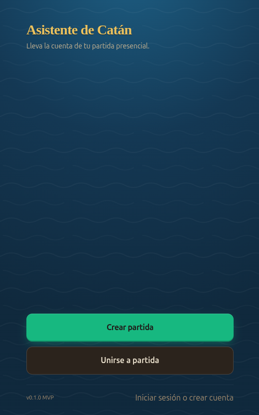

The landing screen (**"Asistente de Catán" — "Keep score for your in-person
game"**). In guest mode there are just two primary actions — **Crear partida**
(create a game) and **Unirse a partida** (join a game) — plus a footer link
**"Iniciar sesión o crear cuenta"** (log in / create an account) and the version
tag. No account is required to play.

### 1.2 Home — signed in

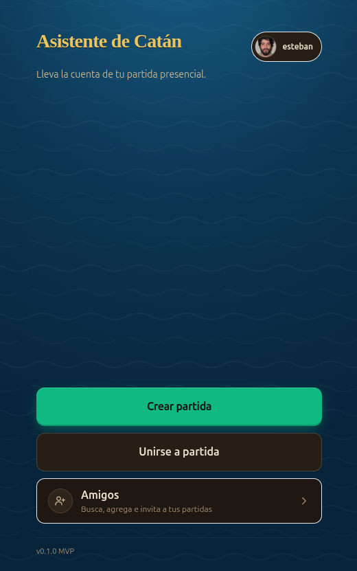

Once you sign in, an **account chip** (avatar + username `esteban`) appears in the
top-right corner, and a third card, **Amigos** (Friends — "search, add and invite
to your games"), is added below the create/join buttons.

## 2. Player profile

### 2.1 Profile overview

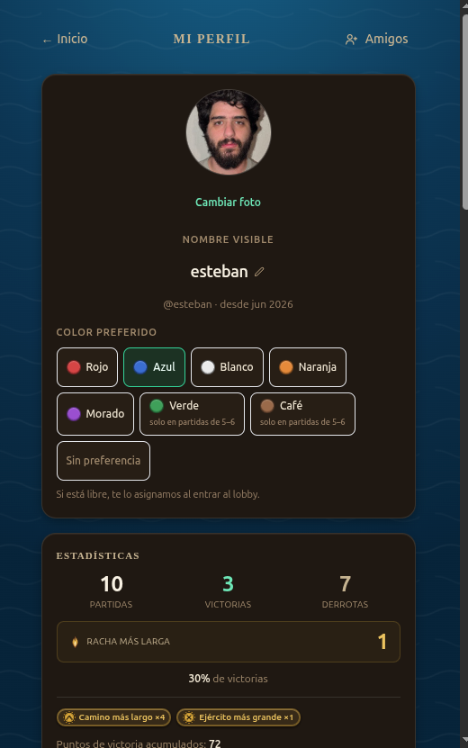

**MI PERFIL** (My profile). At the top: the avatar with a **Cambiar foto**
(change photo) action, the editable **display name**, and the handle + join date.
**COLOR PREFERIDO** lets you pick a preferred player color (green and brown are
labelled *5–6 player games only*), or **Sin preferencia** (no preference — one is
assigned when you enter a lobby). Below begins the **ESTADÍSTICAS** block: games
played, wins, losses, longest streak, win rate, badges (Longest Road ×4, Largest
Army ×1) and career victory points.

### 2.2 Stats & level

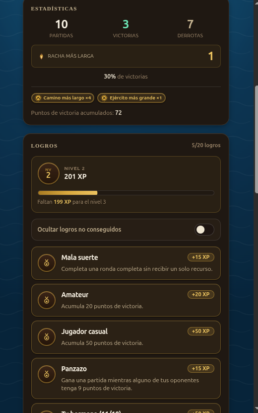

The stats block in full, followed by **LOGROS** (Achievements — "5/20"). The
**level card** shows the current level (Nivel 2, 201 XP) with a progress bar to
the next level, a **"hide unearned achievements"** toggle, and the first earned
achievements with their XP rewards (Mala suerte, Amateur, Jugador casual…).

### 2.3 Achievements list

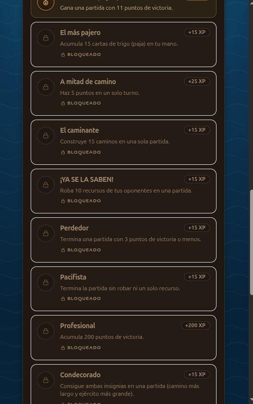

Scrolling the achievements list: each card shows an icon, name, description and
XP value. Locked ones are dimmed and marked **BLOQUEADO** (e.g. *El más pajero*,
*A mitad de camino*, *El caminante*, *Profesional*, *Condecorado*).

## 3. Friends

### 3.1 Friends list

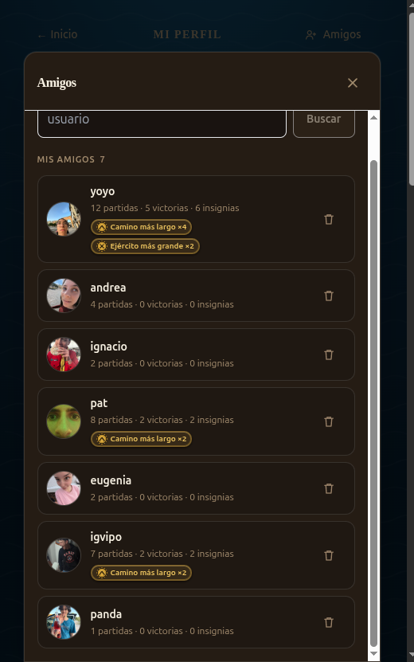

The **Amigos** panel (a modal). A search box (**usuario / Buscar**) to find and
add users sits above **MIS AMIGOS** (7): each friend shows their avatar, quick
stats (games · wins · badges) and a delete button. Badges appear as small chips.

### 3.2 Friend profile

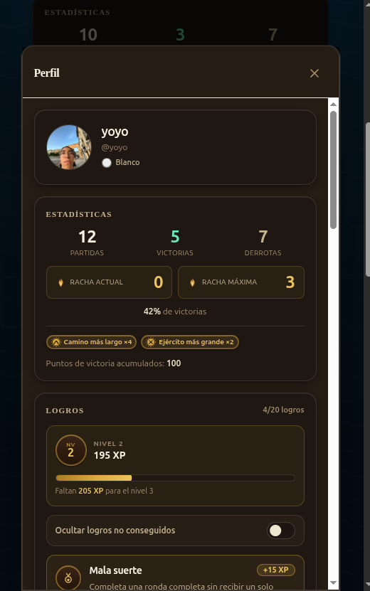

Tapping a friend opens their **full profile** (here `yoyo`): identity + preferred
color, the full **ESTADÍSTICAS** block (games, wins, losses, current and longest
streak, win rate, badges, career VP) and their **LOGROS** with level and XP.

## 4. Lobby

### 4.1 Host view

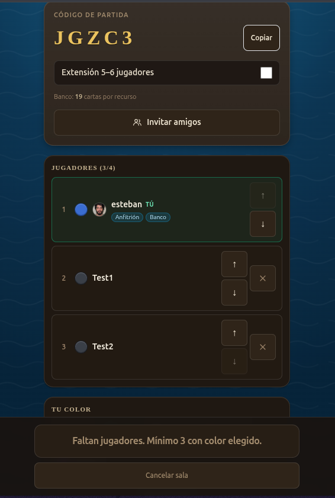

The lobby after creating a room. The **CÓDIGO DE PARTIDA** (game code `JGZC3`)
with a **Copiar** button, a **5–6 player extension** toggle, the bank size, and
**Invitar amigos**. The **JUGADORES (3/4)** list shows each seat; the host can
**reorder** turns with the up/down arrows and **kick** guests with the ✕. The
sticky footer shows why the game can't start yet ("Need more players — minimum 3
with a chosen color") and a **Cancelar sala** button.

### 4.2 Player view & color

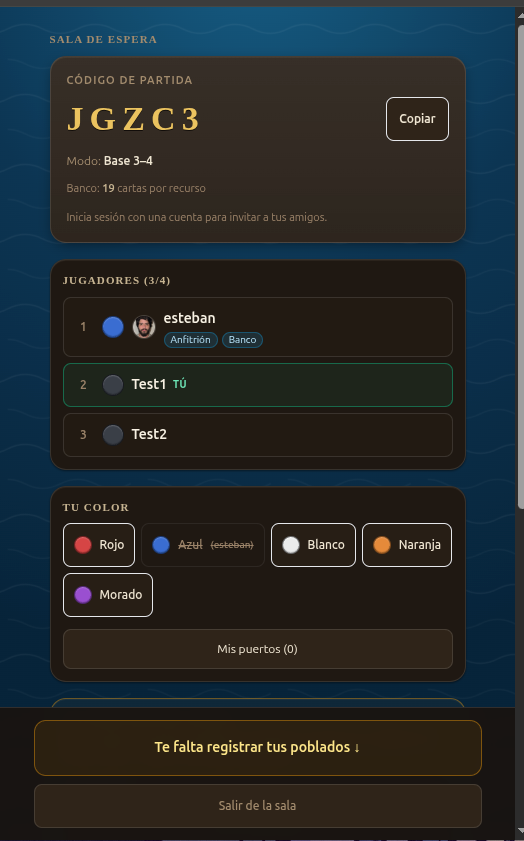

The same lobby (**SALA DE ESPERA**, waiting room) from a joining player's phone.
It shows the mode (Base 3–4) and bank size, the players list (with the current
player marked **TÚ**), and **TU COLOR** — a color picker where taken colors are
greyed out and labelled with their owner (e.g. *Azul (esteban)*). **Mis puertos**
lets a player declare the ports they sit on. The footer nudges: *"You still need
to register your settlements ↓"*.

## 5. Registering the starting settlements

### 5.1 Starting settlements

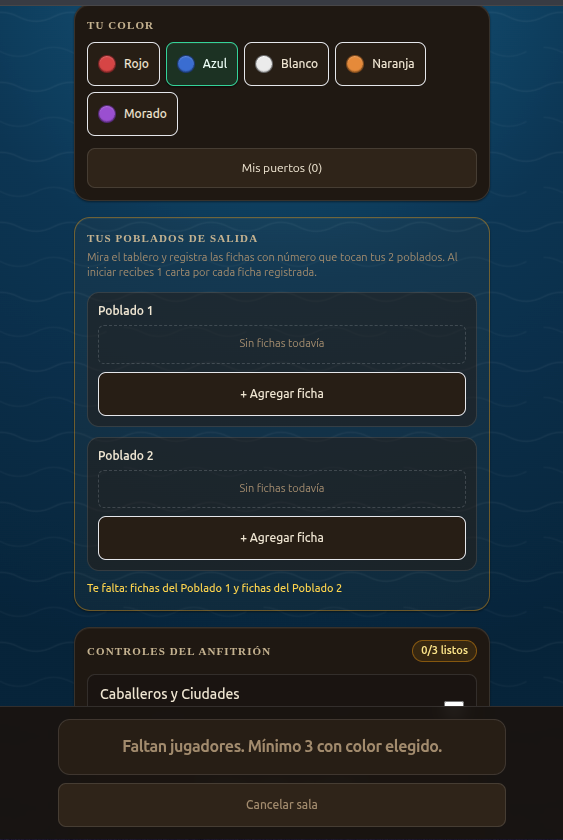

**TUS POBLADOS DE SALIDA** (your starting settlements). Each player records the
number+resource tokens their **2 opening settlements** touch — the app deals one
starting card per registered token. Each settlement card has **+ Agregar ficha**
(add a tile) and shows "no tiles yet" until filled. A hint tracks what's still
missing.

### 5.2 Add a tile

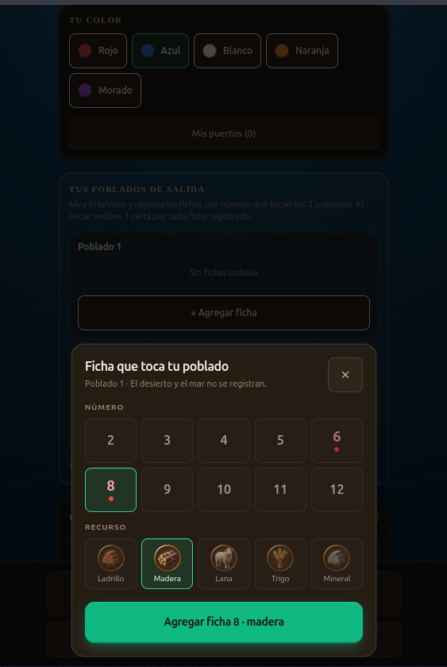

The **"Ficha que toca tu poblado"** (tile touching your settlement) modal. Pick a
**number** (2–12; the desert and sea aren't registered) and a **resource**
(brick / lumber / wool / grain / ore). The confirm button previews the choice —
*Agregar ficha 8 · madera* (add tile 8 · lumber).

### 5.3 Duplicate-tile disambiguation

If a tile with the same number+resource is already in play, the app asks whether
it's the **same physical hex** ("La tocan: …") or a **different one** on the
board — so the engine can distribute production correctly without double-counting.

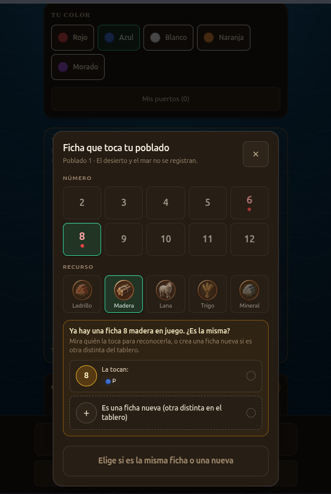

The disambiguation prompt again, before a choice is made.

### 5.4 Confirm the tile

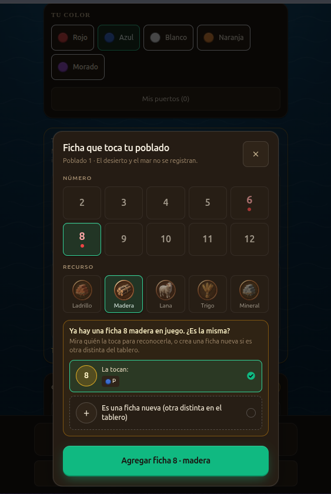

Once you pick *"they touch the same hex"* (green check), the confirm button
enables — *Agregar ficha 8 · madera*.

### 5.5 Host controls

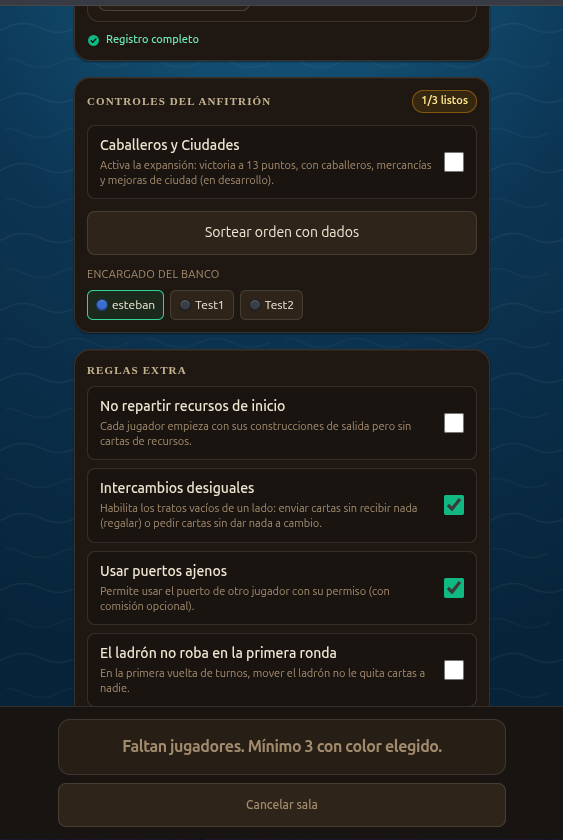

When your registration is complete you see **Registro completo** ✓. The
**CONTROLES DEL ANFITRIÓN** (host controls) track readiness (1/3 ready) and expose
the **Cities & Knights** toggle (victory at 13 points), **Sortear orden con
dados** (draw turn order with dice) and **ENCARGADO DEL BANCO** (choose the bank
manager). Below begins **REGLAS EXTRA** (optional extra rules).

### 5.6 Extra rules

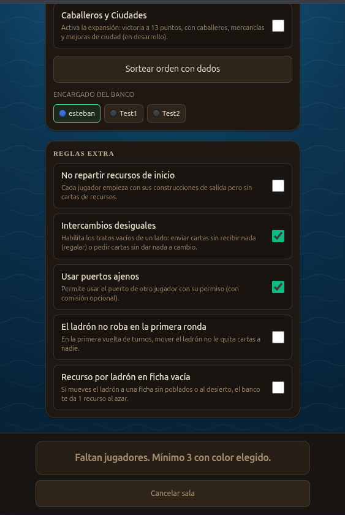

The full **REGLAS EXTRA** list: start without resources, unequal trades, use
other players' ports, robber doesn't steal on the first round, and a bank resource
for moving the robber to an empty tile. Each has a short explanation and a toggle.

## 6. In-game: the turn

### 6.1 Roll phase

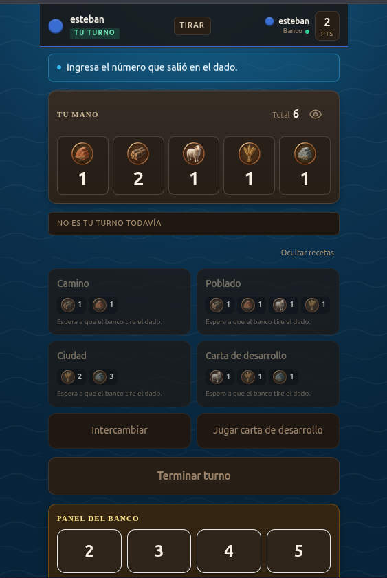

Play begins. The **top bar** shows the active player's marker (name, color,
points) on the left, the **TIRAR** (roll) action, and the bank manager on the
right. The prompt asks the bank manager to **enter the number rolled** on the
physical dice. **TU MANO** (your hand) shows your private resources; the build
recipes are locked until the roll is entered.

### 6.2 Production distributed

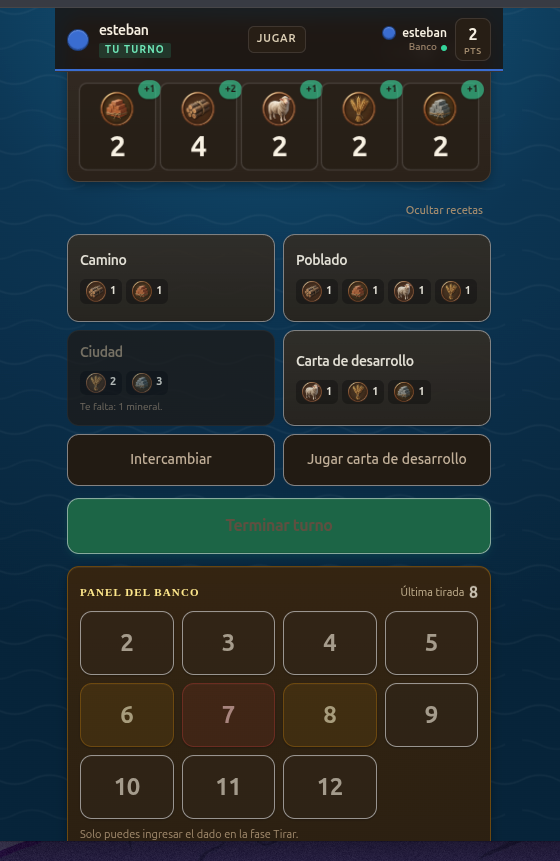

After the number is entered, resources are handed out and each affected resource
shows a green **+N** delta. The build recipes (road, settlement, city, dev card)
now show which resources you still need (e.g. *City — missing 1 ore*). The
**PANEL DEL BANCO** highlights the last roll on its keypad.

### 6.3 Main turn view

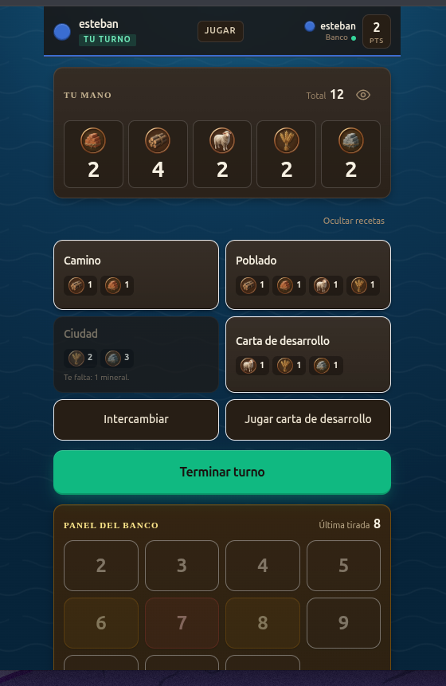

The core play screen. **TU MANO** with the full resource breakdown; the build
recipes; and the three primary actions — **Intercambiar** (trade), **Jugar carta
de desarrollo** (play a dev card), and **Terminar turno** (end turn).

## 7. Bank, log & players panel

### 7.1 Bank panel & construction table

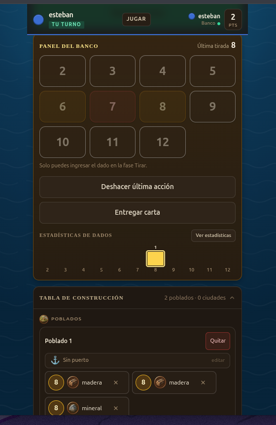

The **PANEL DEL BANCO** with its 2–12 keypad, **Deshacer última acción** (undo)
and **Entregar carta** (grant a card). Below: **ESTADÍSTICAS DE DADOS** (dice
histogram) and the top of the personal **TABLA DE CONSTRUCCIÓN** (construction
table) listing your settlements and their tiles.

### 7.2 Players panel

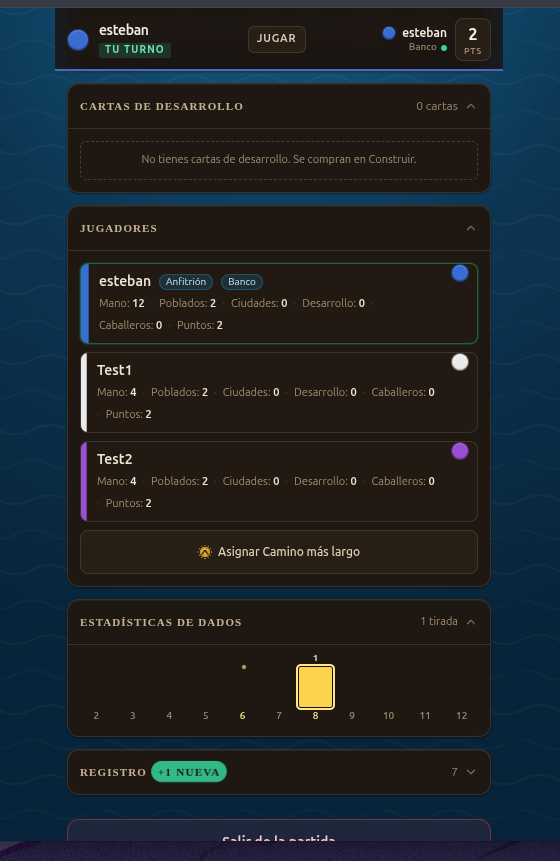

**JUGADORES** — the public state of every player: hand size, settlements, cities,
dev cards, knights and visible points. Private hands are never shown here, only
counts. An **Asignar Camino más largo** (assign Longest Road) control is available
to the bank/host. The **CARTAS DE DESARROLLO** section above shows your own cards.

### 7.3 Game log

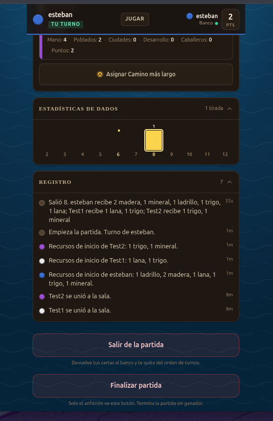

The **REGISTRO** (log) records every event chronologically — rolls and payouts,
starting resources, joins, etc. At the bottom, **Salir de la partida** (leave the
game, returns your cards) and **Finalizar partida** (host-only: end with no
winner).

## 8. Building

### 8.1 Buy a road

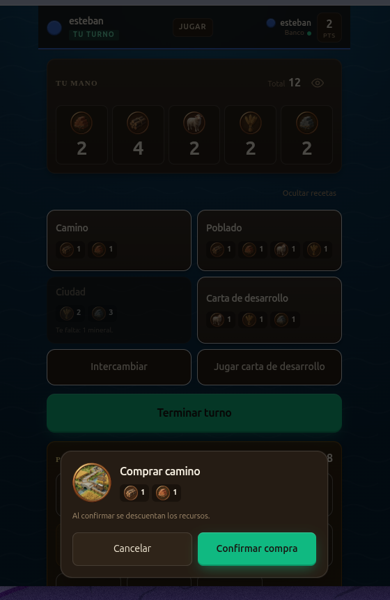

Every purchase asks for confirmation. **Comprar camino** (buy road) shows the
cost (brick + lumber) and warns the resources will be deducted.

### 8.2 Buy a settlement

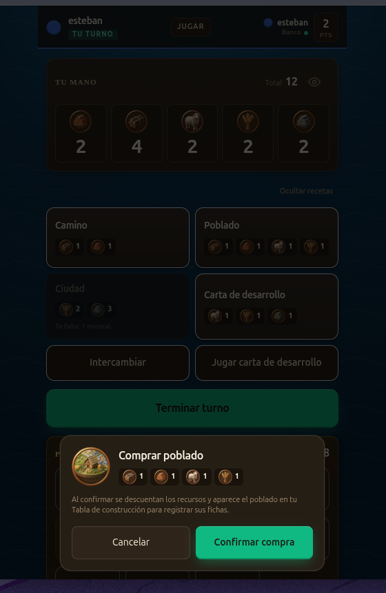

**Comprar poblado** (buy settlement): shows the cost and notes the new settlement
will appear in your construction table so you can register its tiles.

### 8.3 Buy a development card

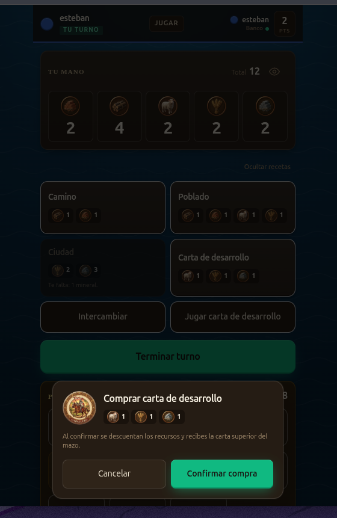

**Comprar carta de desarrollo**: shows the cost and that you'll draw the top card
of the deck.

### 8.4 A card was bought

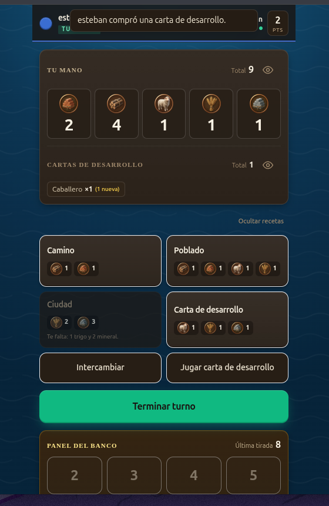

A public notice announces the purchase. **CARTAS DE DESARROLLO** now lists the new
card (**Caballero ×1 · 1 nueva**). Cards bought this turn can't be played until
the next turn.

### 8.5 Hide your own hand

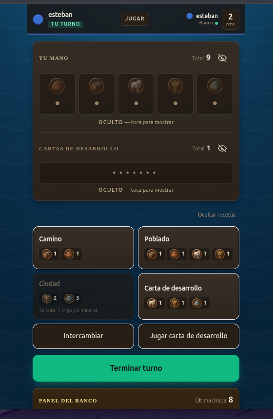

A local privacy toggle (the eye icon) masks **your own** resources and dev cards —
useful at a shared table. The **total** stays visible, but the composition is
hidden ("OCULTO — tap to reveal"). This preference is per-device and never touches
the shared state.

## 9. Development cards

Each development / progress card can be previewed before it's played.

### 9.1 Knight

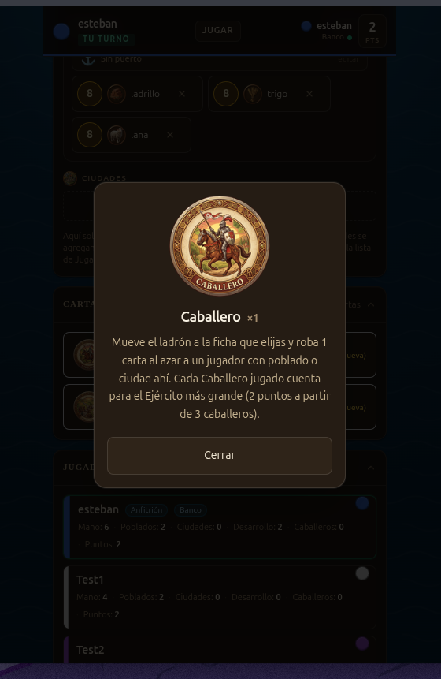

**Caballero** (Knight): move the robber and steal 1 card; each knight played
counts toward Largest Army (2 points from 3 knights).

### 9.2 Road Building

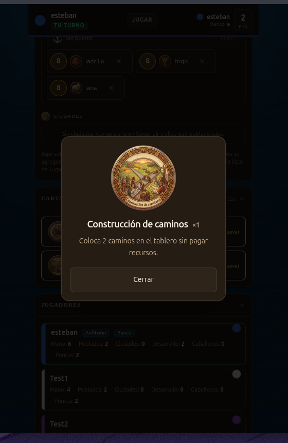

**Construcción de caminos** (Road Building): place 2 roads for free.

### 9.3 Victory Point

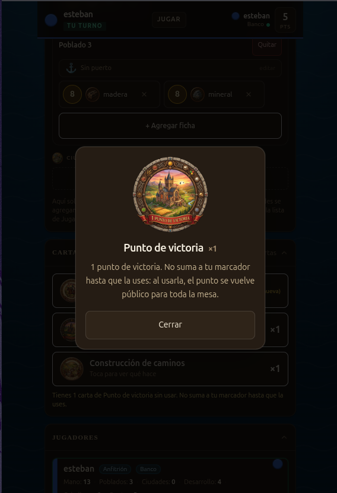

**Punto de victoria** (Victory Point): worth 1 point, but it does **not** count on
your scoreboard until you *use* it — at which point the point becomes public.

### 9.4 The "play a card" menu

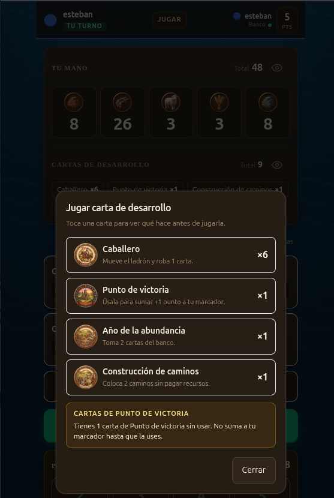

**Jugar carta de desarrollo** lists the cards you own with counts — Caballero ×6,
Punto de victoria ×1, Año de la abundancia ×1, Construcción de caminos ×1 — and a
reminder about unused Victory Point cards. Tap one to preview it before playing.

### 9.5 Road Building (from the play menu)

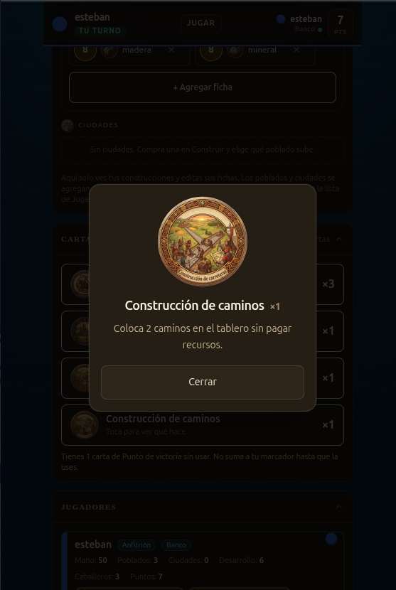

The Road Building preview reached while deciding what to play.

### 9.6 Year of Plenty

**Año de la abundancia** (Year of Plenty): take 2 cards from the bank, of whatever
resource(s) you choose.

## 10. Manual bank grants

### 10.1 Grant a card

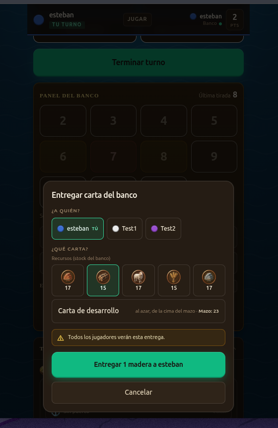

The bank manager can hand a card to anyone with **Entregar carta del banco**:
choose the recipient, then a resource (with live bank stock) or a random dev card
from the deck. A warning makes clear **every player will see this grant**
(cheat-proof).

### 10.2 Grant announced

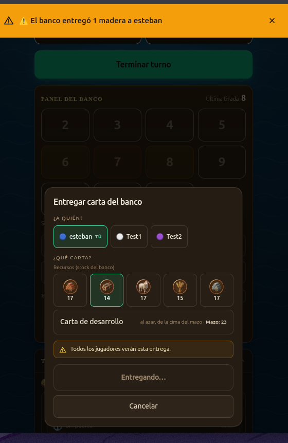

On confirm, a prominent public notice announces it ("The bank gave 1 lumber to
esteban") and it's logged — so manual adjustments can't be hidden.

## 11. Longest Road badge

### 11.1 Assign the badge

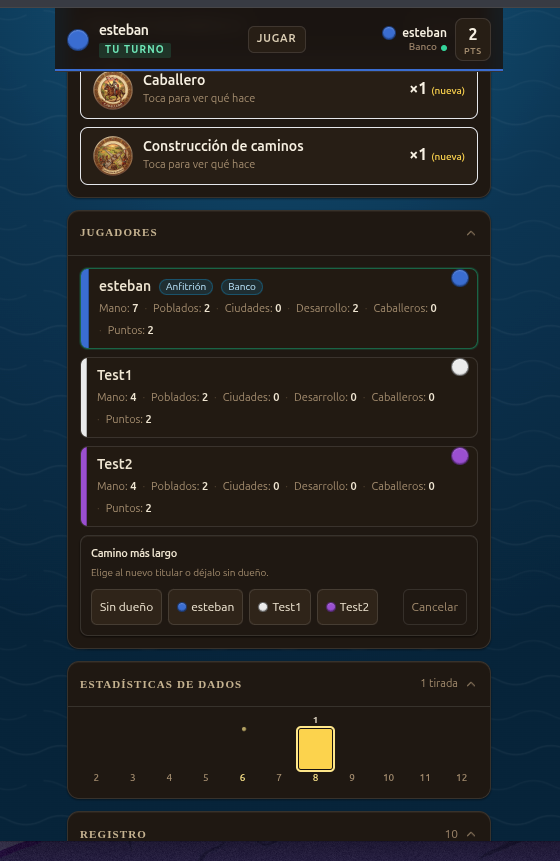

Longest Road is assigned manually (the app can't see the physical board). The
**Camino más largo** control lets the bank/host pick the new holder or leave it
unowned.

### 11.2 Badge assigned

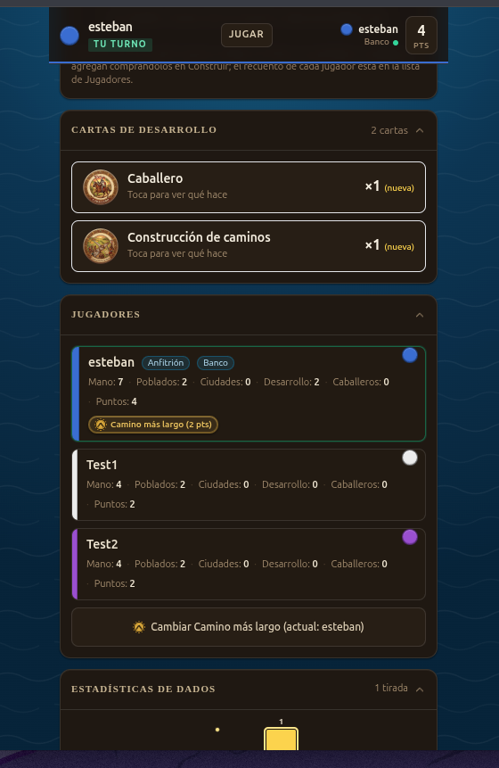

After assigning, the holder shows a **Camino más largo (2 pts)** badge and their
score updates (here esteban jumps to 4 points). A **Cambiar Camino más largo**
control allows reassignment.

## 12. Trading

### 12.1 With the bank / ports

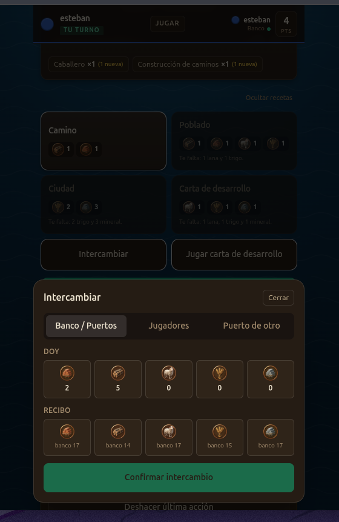

The **Intercambiar** modal, **Banco / Puertos** tab. Pick what you **give** and
what you **receive**; the app applies your best available ratio (4:1 / 3:1 / 2:1)
per resource based on the ports you own.

### 12.2 With other players

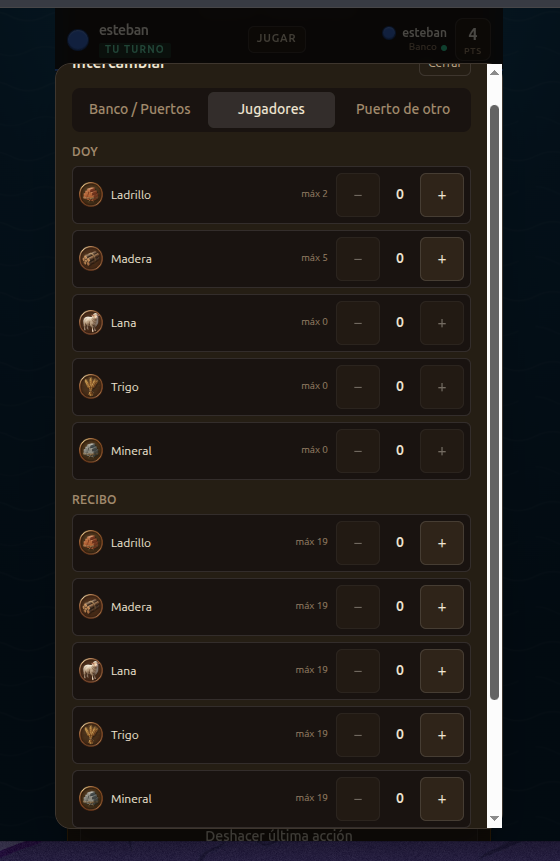

The **Jugadores** tab builds a player-to-player offer with steppers for each
resource on both the **give** (DOY) and **receive** (RECIBO) sides, capped at what
each side can actually pay.

### 12.3 Send the offer

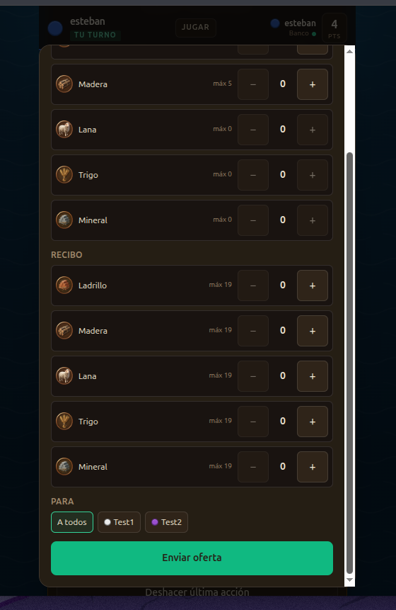

Scrolling down, **PARA** chooses the recipients — **A todos** (everyone) or a
specific player — then **Enviar oferta** broadcasts it. Rejections are
per-player: the offer stays live for the others.

## 13. Using another player's port

This is the optional **shared ports** rule — a 3-step handshake.

### 13.1 Request the port

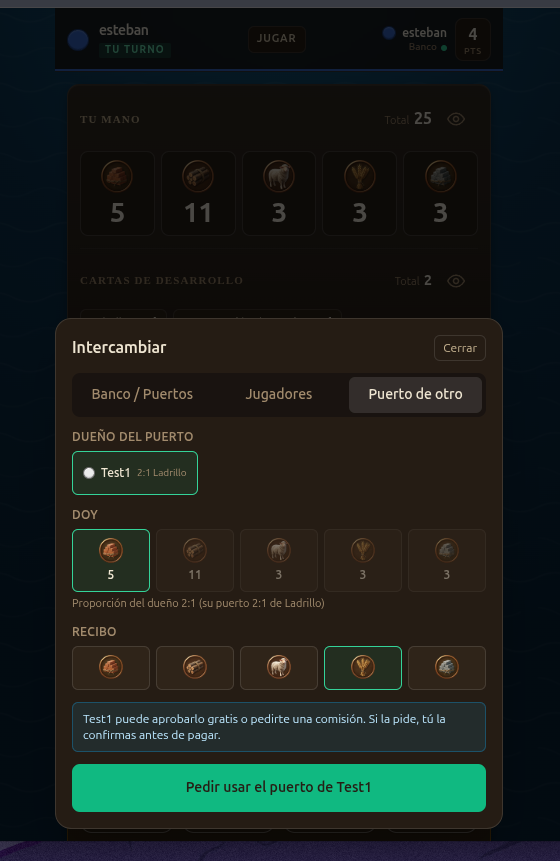

The **Puerto de otro** tab: choose a port **owner** (e.g. *Test1 · 2:1 brick*),
what you give and receive at their ratio, then **Pedir usar el puerto** — the
owner can approve it free or ask for a commission.

### 13.2 Waiting for the owner

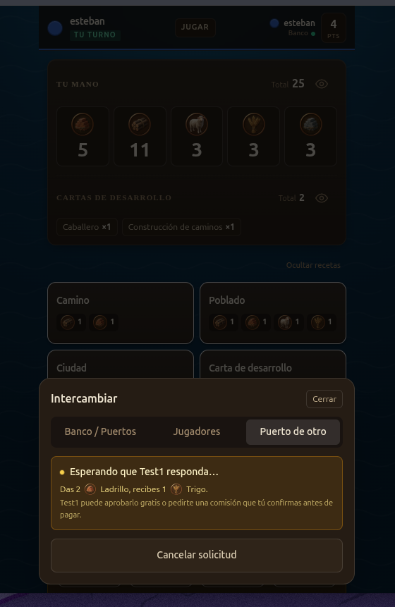

While the request is pending, the requester sees a **"waiting for Test1 to
respond"** state with a **Cancelar solicitud** button.

### 13.3 Owner approves

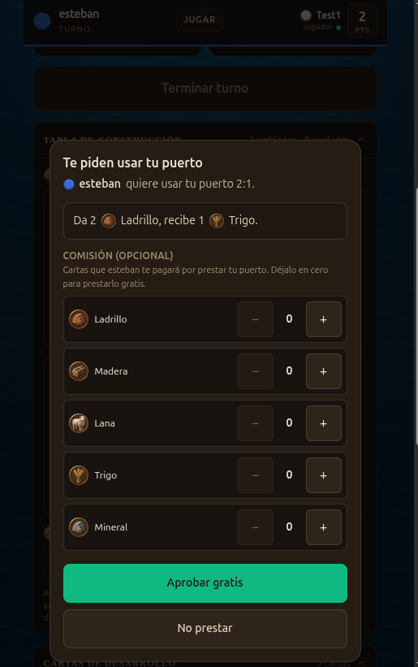

On the **owner's** phone: *"They're asking to use your port."* The owner sets an
optional **commission** (cards the requester will pay) with steppers, then
**Aprobar gratis** (approve free) or **No prestar** (decline).

### 13.4 Requester confirms the commission

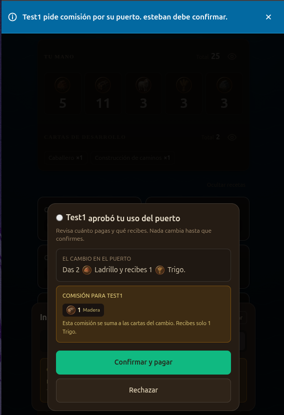

If a commission was set, the requester must confirm: a summary shows the port
exchange plus the **commission** (e.g. 1 lumber to Test1) before **Confirmar y
pagar** or **Rechazar**.

### 13.5 Port used

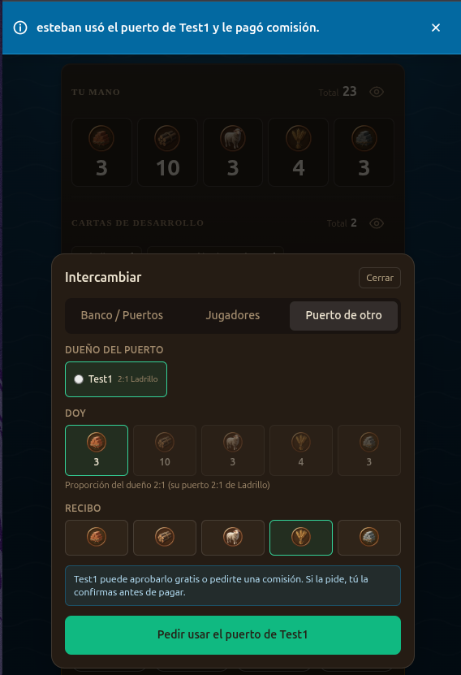

A public notice confirms the port was used and the commission paid; the trade is
applied to both hands.

## 14. The construction table

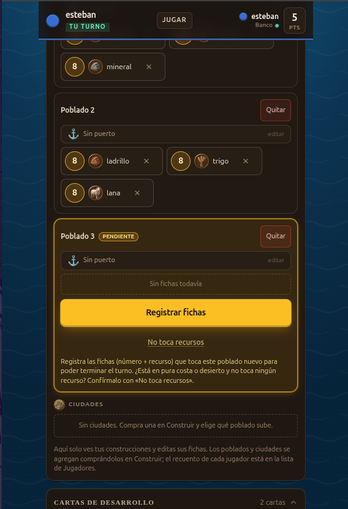

The personal **TABLA DE CONSTRUCCIÓN** lists your settlements/cities and their
tiles (editable). A newly bought settlement appears as **PENDIENTE** with a
**Registrar fichas** (register tiles) action or **No toca recursos** (touches no
resources) — the turn can't end until it's resolved. Cities are added by buying
one and choosing which settlement upgrades.

## 15. The 7: discard & robber

### 15.1 Forced discard

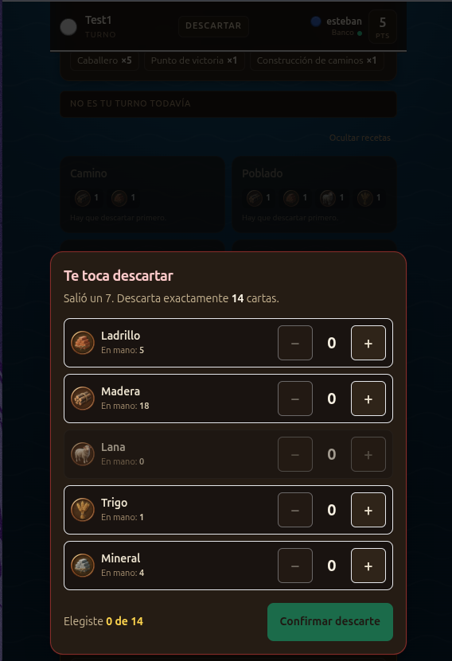

When a 7 is rolled, anyone over the hand limit must discard. **Te toca descartar**
shows exactly how many cards to drop (here 14) with per-resource steppers and a
live "chosen X of N" counter.

### 15.2 Waiting while the robber moves

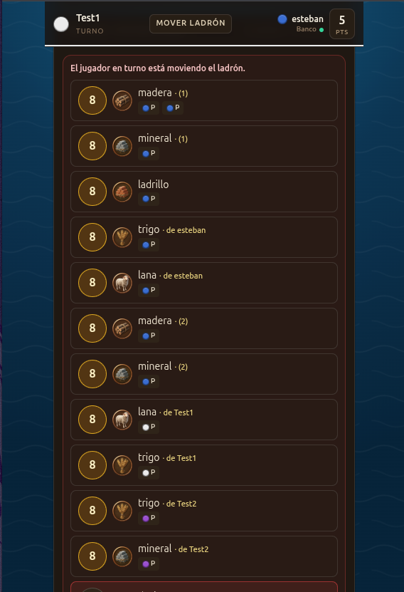

Non-active players see **"the current player is moving the robber"** with the list
of candidate hexes (each tile shows its number, resource and the settlements that
touch it).

### 15.3 Pick the robber's hex

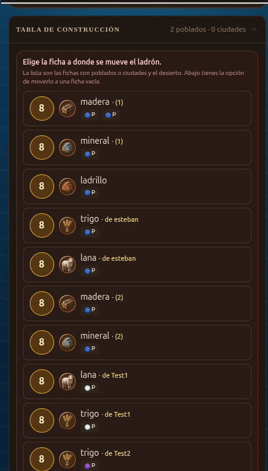

The active player picks the hex from the list of tiles that have settlements/
cities, plus the desert.

### 15.4 Move to an empty tile

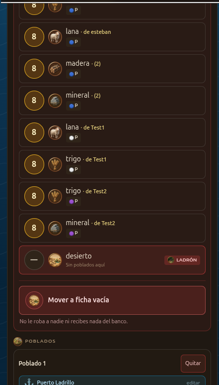

The list also offers the **desert** (which currently holds the robber) and **Mover
a ficha vacía** (move to an empty tile) — which robs no one and grants nothing.

### 15.5 Robber moved (waiting turn)

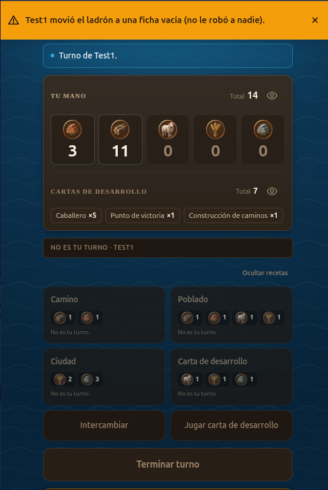

A notice reports the outcome ("Test1 moved the robber to an empty tile — robbed no
one"), and the screen reflects that it's another player's turn: your hand and dev
cards stay visible, but the actions are disabled ("not your turn").

### 15.6 Dice keypad

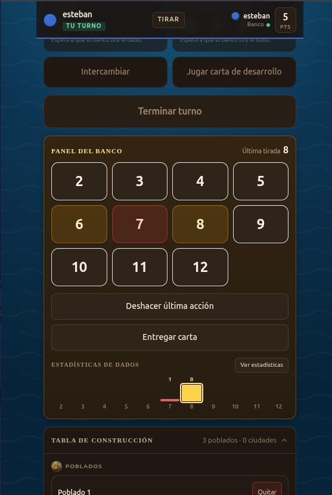

Back on your turn: the **PANEL DEL BANCO** numeric keypad is how the bank manager
records the physical roll (7 highlighted in red), alongside undo, grant-card and
the dice statistics.

## 16. Achievements & undo

### 16.1 Achievement unlocked (and stealing)

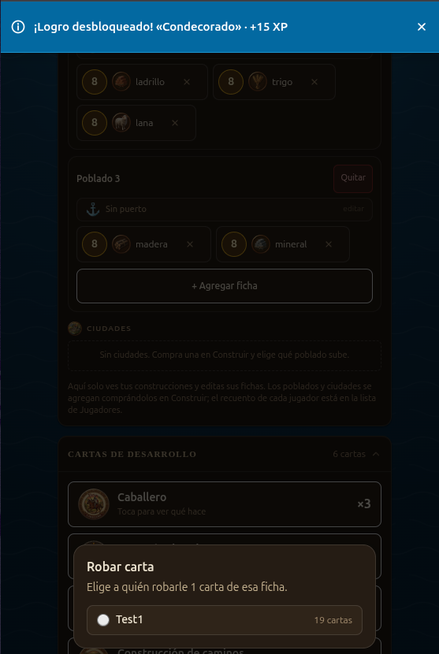

Achievements can unlock **mid-game**: a notice appears ("Achievement unlocked —
«Condecorado» · +15 XP"). Behind it, the **Robar carta** (steal a card) picker
lets the active player choose whom to rob from the robber's hex.

### 16.2 Players panel with both badges

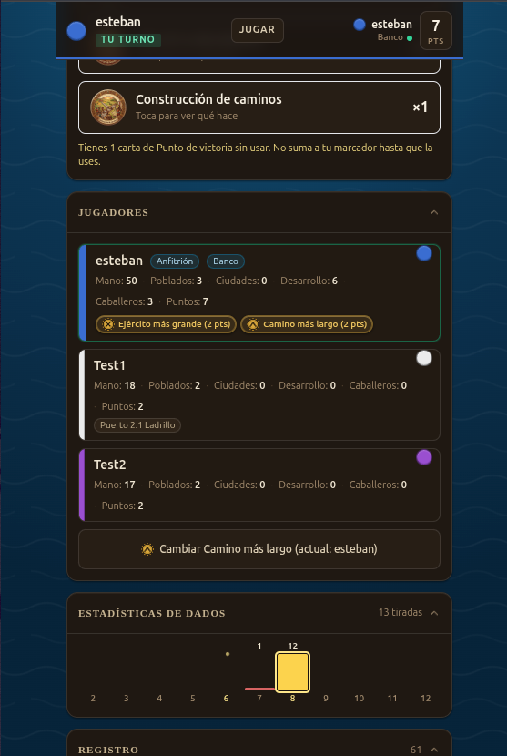

Later in the game the leader shows **both** badges — *Ejército más grande* (Largest
Army, 2 pts) and *Camino más largo* (Longest Road, 2 pts) — in the players panel,
with knights and points updated.

### 16.3 Undo

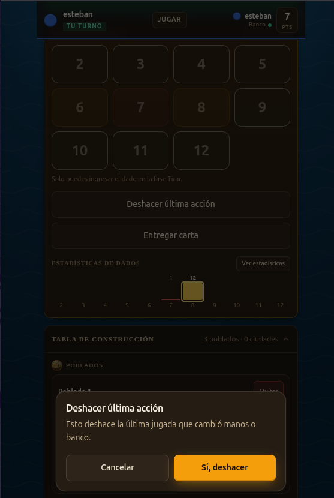

**Deshacer última acción** (undo) reverts the last move that changed hands or the
bank, after a confirmation.

## 17. End of game

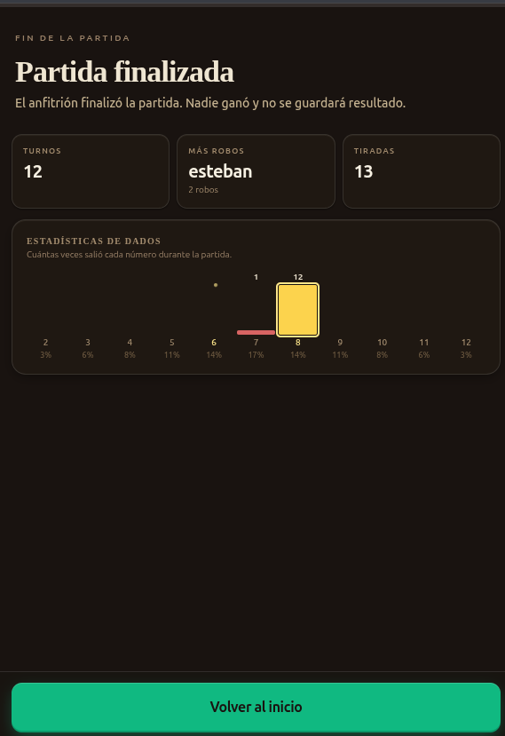

When the game ends, a full-screen summary appears. Here the **host ended the game
with no winner** ("no result will be saved"). It shows totals — turns played, the
**steals MVP**, dice rolls — and a full **dice histogram** with per-number
percentages, plus **Volver al inicio** (back to home). (When a player declares
victory instead, the match and everyone's stats are persisted.)
